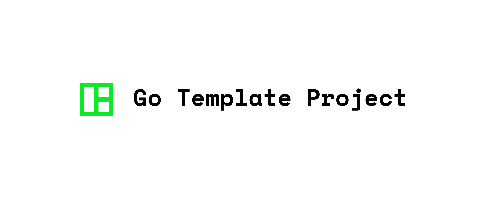

  </img>
  <h3 align="center"><b>PROJECT_TITLE_HERE</b></h3>
  
PROJECT_DESCRIPTION_HERE

    <a href="../../releases">
    

## Latest release

[**Download**](../../releases)

## Template features

* README file image header.
* Badge collection section in README
* Link to releases download in README.
* Support for [Stale bot](https://github.com/marketplace/stale).
* Support for [Semgrep](https://github.com/marketplace/semgrep-devs).
* Default templates for bug reporting, feature request.
* Default SECURITY policy set up.
* License Block.

## Steps after cloning the repository

Go to Github project settings and add the following secrets for

* CODECOV:
* SEMGREP:`SEMGREP_APP_TOKEN`

## Contributing

Everybody is welcome to contribute to the project. Please check out the [**Contribution Steps**](CONTRIBUTING.md) for instructions about how to proceed.
  
And any other comments will be very appreciate.

## License

All rights reserved to project author(s)

Redistribution and use in source and binary forms, with or without modification, are permitted provided that the following conditions are met:

 * Redistributions of source code must retain the above copyright notice, this list of conditions and the following disclaimer.
 * Redistributions in binary form must reproduce the above copyright notice, this list of conditions and the following disclaimer in the documentation and/or other materials provided with the distribution.
 * Uses GPL license described below

This program is free software: you can redistribute it and/or modify it under the terms of the GNU General Public License as published by the Free Software Foundation, either version 3 of the License, or (at your option) any later version.

See [**LICENSE**](LICENSE) file for full license details.
